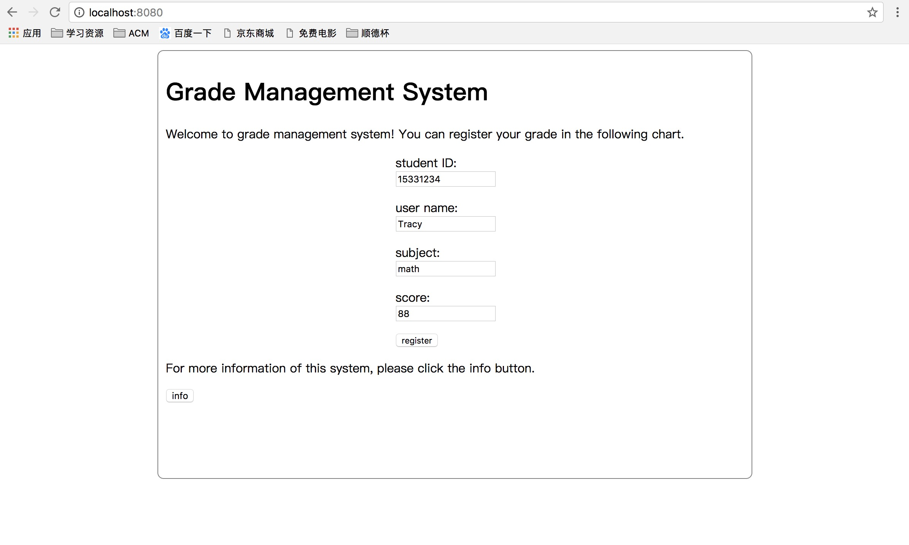
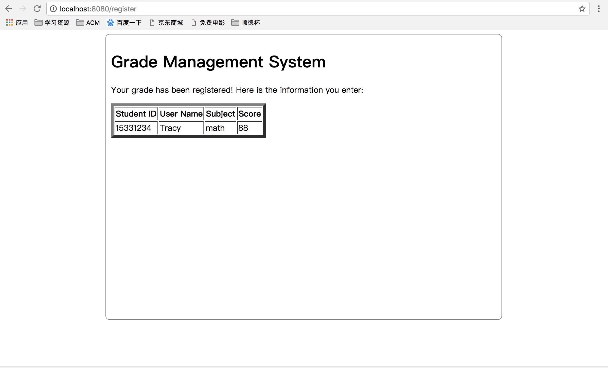

# Toy Web Service Application: cloudgo-io

In this project, I implement a toy web service application using Golang, which shows how Golang can support for static html request, javascript-io, html template use, form processing and so on.

## Introduction

*cloudgo-io* is a simple grade management system, where students can register their scores of an subject. After successful registration, students can confirm the information they entered again by checking a table output by *cloudgo-io*. Students can also get the detail information of this service by clicking the `info` button on the homepage.

## Run

Just download this program and run either

```shell
$ go build && ./cloudgo-io
```

or

```shell
$ go run main.go
```

then you can see the server is running:

```shell
[negroni] listening on :8080

```

You can also specify the port listened by the server:

```shell
$ go run main.go -p 23333

[negroni] listening on :23333

```

## Four Basic Functions Required by Homework

### 1. Static html service.
After running the server, use `curl` to get the static html:

```shell
$ curl -v localhost:8080
* Rebuilt URL to: localhost:8080/
*   Trying ::1...
* TCP_NODELAY set
* Connected to localhost (::1) port 8080 (#0)
> GET / HTTP/1.1
> Host: localhost:8080
> User-Agent: curl/7.54.0
> Accept: */*
> 
< HTTP/1.1 200 OK
< Content-Type: text/html; charset=UTF-8
< Date: Tue, 21 Nov 2017 16:29:08 GMT
< Content-Length: 1084
< 
<html>
  <head>
    <link rel="stylesheet" href="css/main.css" />
    <script src="http://code.jquery.com/jquery-latest.js"></script>
    <script src="js/getData.js"></script>
  </head>

  <body>
    <div class="intro">
      <h1>Grade Management System</h1>
      <p>Welcome to grade management system! You can register your grade in the following chart.</p>

      <div class="reg-form">
        <form action="/register" method="post">
          <p>student ID: <input type="text" name="id"></p>
          <p>user name: <input type="text" name="username"> </p>
          <p>subject: <input type="text" name="subject"> </p>
          <p>score: <input type="text" name="score"> </p>
          <p><input type="submit" value="register"> </p>
        </form>
      </div>

      <p>For more information of this system, please click the info button.</p>
      <button class="info">info</button>
      <p class="greeting-author">author: Jack Cheng</p>
      <p class="greeting-os">operating system: linux</p>
      <p class="greeting-date">data: 2017-11-20</p>
    </div>
  </body>
</html>
* Connection #0 to host localhost left intact
```

### 2. Template use and javascript access.
The original *index.html* file is:

```html
......
<p>For more information of this system, please click the info button.</p>
<button class="info">info</button>
<p class="greeting-author">{{.Author}}</p>
<p class="greeting-os">{{.OS}}</p>
<p class="greeting-date">{{.Date}}</p>
......
```

where I just use the template variables `{{.Author}}`, `{{.OS}}` and `{{.Date}}`. The concrete values of those variables are sent by javascript. Thus, when you use `curl` to access the home page, you will get:

```html
......
<p>For more information of this system, please click the info button.</p>
<button class="info">info</button>
<p class="greeting-author">author: Jack Cheng</p>
<p class="greeting-os">operating system: linux</p>
<p class="greeting-date">data: 2017-11-20</p>
......
```

where `{{.Author}}`, `{{.OS}}` and `{{.Date}}` are replaced by their concrete values. These values are specified by *home.go*:

```go
// render the home page and write to the response
func homeHandler(formatter *render.Render) http.HandlerFunc {
	return func(w http.ResponseWriter, req *http.Request) {
		formatter.HTML(w, http.StatusOK, "index", struct {
			Author string `json:"author"`
			OS     string `json:"os"`
			Date   string `json:"date"`
		}{Author: "author: Jack Cheng", OS: "operating system: linux", Date: "data: 2017-11-20"})
	}
}
```

and when the html file is loaded, the following javascript code will require the data from the server:

```js
$.ajax({
    url: "/"
}).then(function(data) {
    $('.greeting-author').append(data.author).hide();
    $('.greeting-os').append(data.os).hide();
    $('.greeting-date').append(data.date).hide();
});
```

### 3. Post a form and output a table.
Use a browser to access the home page, and fill in the form:



after clicking the `register` button, you can get the table of registered information:



### 4. Deal with /unknown

Using `curl` to access the unknown page `localhost:8080/unknown`, you will get the 501 not implemented error:

```shell
$ curl -v localhost:8080/unknown
*   Trying ::1...
* TCP_NODELAY set
* Connected to localhost (::1) port 8080 (#0)
> GET /unknown HTTP/1.1
> Host: localhost:8080
> User-Agent: curl/7.54.0
> Accept: */*
> 
< HTTP/1.1 501 Not Implemented
< Content-Type: text/plain; charset=utf-8
< X-Content-Type-Options: nosniff
< Date: Tue, 21 Nov 2017 17:15:39 GMT
< Content-Length: 20
< 
501 Not Implemented
* Connection #0 to host localhost left intact
```